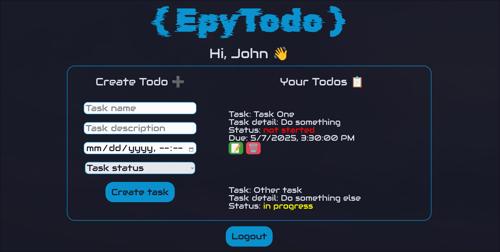

<h1 align="center">
    EpyTodo - Todo list app - 2025
    
</h1>

## How to set-up ?
Import database structure into mysql
```
cat epytodo.sql | mysql -u "mysql_user" -p
```
Install required npm packages
```
npm install
```
Generate secret token for jsonwebtoken
```
openssl rand -hex 32
```
Start the server
```
npm start
```

> [!WARNING]
> Don't forget to set environement variable from the .env.exemple !

## How do i use it?
Using the back-end: You can use Postman (or other API tester): Here is a listing of all the routes we expect for this project.

| Route                  | Method | Protected | Description             |
|------------------------|--------|-----------|-------------------------|
| `/register`            | POST   | No        | Register a new user     |
| `/login`               | POST   | No        | Connect a user          |
| `/user`                | GET    | Yes       | View all user info      |
| `/user/todos`          | GET    | Yes       | View all user tasks     |
| `/users/:id` or `:email` | GET  | Yes       | View user information   |
| `/users/:id`           | PUT    | Yes       | Update user information |
| `/users/:id`           | DELETE | Yes       | Delete user             |
| `/todos`               | GET    | Yes       | View all the todos      |
| `/todos/:id`           | GET    | Yes       | View the todo           |
| `/todos`               | POST   | Yes       | Create a todo           |
| `/todos/:id`           | PUT    | Yes       | Update a todo           |
| `/todos/:id`           | DELETE | Yes       | Delete a todo           |


Using the front-end: Simply use your favorite internet browser and go to http://localhost:port_you_set_in_env

<p align="center">
    
</p>

## Author
- [Malo Brunetti](https://github.com/G0LDDARK)